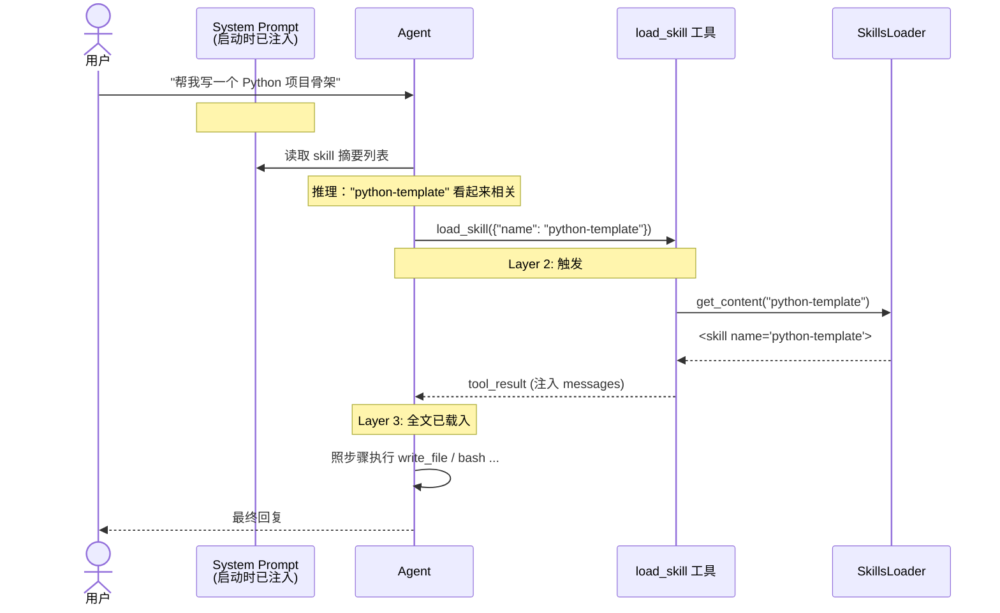

# Skills System（技能系统 / 渐进式披露）

> 模块路径：`src/agent/skills.py`、`src/tools/load_skill_tool.py`、`src/tools/skill_writer_tool.py`、`src/agent/frontmatter.py`
> Skill 目录：`skills/`（项目内置）与 `~/.mini-agent/skills/user/`（用户自建）

---

## 1. 模块概览

### 1.1 要解决的问题：提示词爆炸 vs 能力扩展

一个 agent 想要“什么都会”，传统做法是把所有操作手册、API 文档、最佳实践都塞进 system prompt。这种“全量预加载”策略会立刻撞上三堵墙：

1. **Token 成本爆炸**：每轮对话都把所有文档重复发给 LLM，长文档消耗的 input token 成指数级增长。
2. **注意力稀释**：LLM 的注意力会被无关上下文稀释。塞 50 个领域的文档，回答 1 个领域的问题时，模型反而更容易“跑题”。
3. **维护负担**：每加一个能力，都要改系统提示词；每改一次手册，全量 prompt 都要重新测试。

mini-agent 的 Skills 系统借鉴 Claude Code 的 **progressive disclosure（渐进式披露）** 设计来解决这个矛盾：**默认只暴露“目录”，等 agent 真正需要时再调取“正文”**。能力可以无限扩展，提示词体积却恒定。

### 1.2 在 mini-agent 中的定位

Skills 系统处在 agent 的“知识层”，与 tools（动作层）、memory（记忆层）并列：

| 层 | 职责 | 加载时机 |
|----|------|---------|
| Tools | “能做什么”——执行 bash、读写文件等动作 | 启动时全量注册 |
| Skills | “怎么做”——操作手册、API 契约、最佳实践 | 启动时只载摘要，正文按需 |
| Memory | “记得什么”——跨会话的用户偏好 | 按关键词召回 |

参考 `src/agent/skills.py:1-6` 的模块 docstring，作者明确写道：

> Uses progressive disclosure:
> - System prompt only injects one-line summaries (get_descriptions).
> - Full docs loaded on demand (get_content, called by the load_skill tool).

这两行就是整个模块的设计契约。

---

## 2. 核心概念：Progressive Disclosure（渐进式披露）

### 2.1 概念解释

**Progressive disclosure** 是一种“按需展开”的信息架构原则：先给用户一个**索引**，等用户表达明确兴趣后再展示**详情**。它的核心洞察是——大多数信息在大多数时刻是不需要的，把它强行塞进视野只会拖累决策。

### 2.2 类比：图书馆目录 vs 书本内容

想象你走进一座大型图书馆：

- **目录厅（system prompt 里的 skill 摘要）**：墙上挂着一张卡片目录，每本书只有一行字 ——《Python 项目模板》、《React 测试套路》、《PostgreSQL 性能调优》。你扫一眼就知道馆里有什么，但看不到任何具体内容。
- **书架（skills 目录）**：真正的书在架子上，几百页厚。你不会一次取下所有书。
- **借阅窗口（load_skill 工具）**：当你确认要某一本书时，走到窗口报书名，管理员把整本书递给你。

Skills 系统把这个比喻代码化了：

| 图书馆 | Skills 系统 | 代码位置 |
|--------|------------|---------|
| 目录卡片 | `get_descriptions()` 返回的摘要文本 | `skills.py:93-109` |
| 书架扫描 | `_load()` 遍历 skills 目录 | `skills.py:77-87` |
| 借阅窗口 | `load_skill` 工具调用 `get_content(name)` | `load_skill_tool.py:27-33` |
| 书的封面（书名+简介） | YAML frontmatter 的 name/description | `frontmatter.py:9-40` |
| 书的正文 | Markdown body | `skills.py:54-61` |

### 2.3 三层架构

```
┌──────────────────────────────────────────────────────────┐
│ Layer 1: SUMMARY   (启动时载入，常驻 system prompt)        │
│   一行字：name + description                              │
│   占用 token: ~30/skill                                   │
│   目的：让 agent 知道"有哪些 skill 可用"                    │
└──────────────────────────────────────────────────────────┘
                          │
                          │ agent 读了摘要，判断"我需要这个 skill"
                          ▼
┌──────────────────────────────────────────────────────────┐
│ Layer 2: TRIGGER   (运行时判断)                           │
│   - 显式触发：agent 主动调用 load_skill("example")        │
│   - 语义触发：description 命中用户意图                     │
│   占用 token: 0（只是决策）                                │
└──────────────────────────────────────────────────────────┘
                          │
                          │ load_skill 工具执行
                          ▼
┌──────────────────────────────────────────────────────────┐
│ Layer 3: FULL DOC  (按需载入，注入对话历史)                │
│   完整 Markdown body，可能几千字                          │
│   占用 token: 数百~数千（仅本次对话）                      │
│   目的：让 agent 拿到具体步骤、API 契约、代码示例           │
└──────────────────────────────────────────────────────────┘
```

### 2.4 一次完整的披露过程时序图



关键点：**Layer 1 永远在，Layer 3 只在需要的那一轮对话出现**。10 个 skill 各 2000 字，全量预加载要 20000 字；渐进式披露下，典型对话只需 30 字（摘要）+ 2000 字（命中的那一个），节省 90%。

---

## 3. Skill 文档格式规范

### 3.1 YAML frontmatter 字段

每个 skill 是一个目录，目录里必须有一个 `SKILL.md`。文件分两部分：

1. **YAML frontmatter**：用 `---` 包裹的元数据块，位于文件最顶部。
2. **Markdown body**：正文，agent 调 `load_skill` 时才读到。

mini-agent 的 frontmatter parser（`frontmatter.py:9-40`）是一个**轻量级手写解析器**，不依赖 PyYAML。它支持三种值类型：

| 字段 | 类型 | 必填 | 用途 |
|------|------|------|------|
| `name` | string | 是 | skill 的唯一标识，用于 `load_skill("name")` |
| `description` | string | 是（推荐） | 一行摘要，注入 system prompt |
| `category` | string | 否 | 分类标签，控制摘要展示顺序 |
| `triggers` | list | 否 | 关键词列表（注：当前实现未自动触发，留作文档用途） |
| 其他自定义 | string/list/bool | 否 | 存入 `metadata` dict，body 可读取 |

`category` 的取值影响摘要分组顺序，见 `skills.py:89-91`：

```python
_CATEGORY_ORDER = [
    "data-source", "strategy", "analysis", "tool", "other",
]
```

不在该列表里的 category 会按字母序追加在后面（`skills.py:101-102`）。

### 3.2 主体 Markdown 结构

body 没有强制结构，但约定俗成的章节是：

```markdown
# <Skill Name>

## Overview
一段话讲清楚这个 skill 解决什么问题。

## Guidelines / Steps
编号步骤或要点列表。

## Available Tools
本 skill 推荐使用的工具表格。

## Example Usage
真实对话或代码片段。
```

### 3.3 完整剖析：`skills/example/SKILL.md`

这是项目自带的示例 skill，让我们逐行拆解（对照 `skills/example/SKILL.md:1-46`）：

```markdown
---
name: example                                       # ← 必填，唯一 id
description: An example skill demonstrating the     # ← 一行摘要，进 system prompt
  skill format and available tools
triggers:                                           # ← 列表类型，parser 识别 [a, b] 语法
  - example
  - demo
---
```

frontmatter 解析后得到的 dict：

```python
{
    "name": "example",
    "description": "An example skill demonstrating the skill format and available tools",
    "triggers": ["example", "demo"],
}
```

注意 `frontmatter.py:32-34` 处理列表的代码：

```python
if value.startswith("[") and value.endswith("]"):
    items = [item.strip().strip("'\"") for item in value[1:-1].split(",")]
    meta[key] = [i for i in items if i]
```

但 example 用的是 YAML 的多行列表语法（`- item`）。**这是一个值得注意的细节**：当前的 parser 其实**不识别多行列表语法**——它按行 split，遇到 `- example` 这一行，`": "` 不在其中（只有 `-`），会被 `if ":" not in line: continue` 跳过（`frontmatter.py:26-27`）。所以 `triggers` 字段在 example 里实际上是**没被解析进 metadata 的**，它更多是给人类读者看的文档说明。这是 mini-agent 作为“教学项目”刻意保留的简化：真正的 keyword 触发逻辑并未实现，agent 完全靠 description 的语义匹配来决定是否调 `load_skill`。

body 部分（`skills/example/SKILL.md:9-46`）示范了一个 skill 文档应有的所有要素：Overview、Guidelines、Available Tools 表格、Example Usage。它是新写 skill 时的模板。

---

## 4. SkillsLoader 精读（重点）

`SkillsLoader` 是整个模块的核心，只有 124 行（`skills.py:67-123`），但承担了三大职责：扫描目录、解析 frontmatter、提供摘要与正文。

### 4.1 数据结构：`Skill` dataclass

```python
# skills.py:17-37
@dataclass
class Skill:
    name: str
    description: str = ""
    category: str = "other"
    body: str = ""
    dir_path: Optional[Path] = None
    metadata: Dict[str, Any] = field(default_factory=dict)

    def load_support_file(self, filename: str) -> Optional[str]:
        ...
```

`dir_path` 保留了 skill 所在目录，是为了支持**辅助文件**——一个 skill 不只能有 SKILL.md，还可以有 `references/`、`templates/` 等子目录（见 `skill_writer_tool.py:14` 的 `_ALLOWED_SUBDIRS`）。`load_support_file` 让 skill 正文里可以引用额外资源，但按需读取，不进 system prompt。

### 4.2 扫描两个目录：项目级 + 用户级

构造函数（`skills.py:70-75`）：

```python
def __init__(self, skills_dir: Optional[Path] = None,
             user_skills_dir: Optional[Path] = None) -> None:
    self.skills_dir = skills_dir or Path(__file__).resolve().parents[2] / "skills"
    self._user_skills_dir = user_skills_dir or USER_SKILLS_DIR
    self.skills: List[Skill] = []
    self._load()
```

两个默认路径：

- **项目内置 skills**：`Path(__file__).resolve().parents[2] / "skills"`，即仓库根目录下的 `skills/`。`parents[2]` 从 `src/agent/skills.py` 往上跳两级（`agent → src → 仓库根`）。
- **用户 skills**：`USER_SKILLS_DIR = Path.home() / ".mini-agent" / "skills" / "user"`（`skills.py:64`）。用户在任意项目里用 `save_skill` 写的 skill 都放这里，**跨项目共享**。

### 4.3 `_load()`：去重的扫描逻辑

```python
# skills.py:77-87
def _load(self) -> None:
    seen_names: set[str] = set()
    for directory in (self._user_skills_dir, self.skills_dir):
        if not directory or not directory.exists():
            continue
        for path in sorted(directory.iterdir()):
            if path.is_dir() and (path / "SKILL.md").exists():
                skill = _load_skill_dir(path)
                if skill and skill.name not in seen_names:
                    self.skills.append(skill)
                    seen_names.add(skill.name)
```

四个关键设计：

1. **用户目录优先**（元组顺序）：`(self._user_skills_dir, self.skills_dir)`，user 目录在前。配合 `seen_names` 去重，**用户可以用同名 skill 覆盖项目内置 skill**——这是 hot-patch 能力的基础。
2. **`sorted(directory.iterdir())`**：保证跨平台、跨文件系统的加载顺序稳定（不同 OS 的 `iterdir` 顺序不保证）。
3. **只认 `SKILL.md`**：目录里没有 `SKILL.md` 就被跳过。这把“skill 的入口文件”约定死了。
4. **`seen_names` 去重**：以 `name` 字段（不是目录名）为唯一键。如果 user 目录和项目目录都有 `name: example`，只保留先扫到的 user 版本。

### 4.4 `_load_skill_dir()`：单 skill 解析

```python
# skills.py:40-61
def _load_skill_dir(dir_path: Path) -> Optional[Skill]:
    skill_file = dir_path / "SKILL.md"
    if not skill_file.exists():
        return None
    try:
        text = skill_file.read_text(encoding="utf-8")
    except Exception:
        return None

    meta, body = _parse_frontmatter(text)
    name = meta.get("name", dir_path.name)
    if not name:
        return None

    return Skill(
        name=name,
        description=meta.get("description", ""),
        category=meta.get("category", "other"),
        body=body,
        dir_path=dir_path,
        metadata=meta,
    )
```

容错策略值得学习：

- 文件不存在 → 返回 `None`，调用方跳过。
- 读文件异常 → 吞掉异常返回 `None`，**不让一个坏 skill 拖垮整个 agent 启动**。
- `name` 缺失时回退到目录名（`dir_path.name`），但若回退后仍为空才放弃。

### 4.5 `get_descriptions()`：摘要注入系统提示词

这是 progressive disclosure 的 Layer 1 出口，被 `ContextBuilder` 调用（`context.py:87`）。

```python
# skills.py:93-109
def get_descriptions(self) -> str:
    if not self.skills:
        return "(no skills)"

    groups: Dict[str, List[Skill]] = {}
    for skill in self.skills:
        groups.setdefault(skill.category, []).append(skill)

    ordered_cats = [c for c in self._CATEGORY_ORDER if c in groups]
    ordered_cats += [c for c in sorted(groups) if c not in ordered_cats]

    lines: List[str] = []
    for cat in ordered_cats:
        lines.append(f"\n### {cat}")
        for skill in groups[cat]:
            lines.append(f"  - {skill.name}: {skill.description}")
    return "\n".join(lines)
```

输出形如：

```
### tool
  - example: An example skill demonstrating the skill format and available tools

### strategy
  - python-template: Quick Python project scaffolding
```

两个细节：

- **分组 + 排序**：按 category 分组，组内按加载顺序（稳定），组间按 `_CATEGORY_ORDER` 优先级 + 字母序兜底。这让 system prompt 里的 skill 列表**可读、可预测**。
- **空列表回退**：`return "(no skills)"` 而不是空字符串，避免 system prompt 里出现空白章节让 agent 困惑。

### 4.6 与 `context.py` 的协作

`ContextBuilder.build_system_prompt()`（`context.py:74-91`）把 skill 摘要拼进系统提示词：

```python
return _SYSTEM_PROMPT.format(
    ...
    skill_count=len(self.skills_loader.skills),
    ...
    skill_descriptions=self.skills_loader.get_descriptions(),
    ...
)
```

系统提示词模板（`context.py:19-53`）里对应的位置：

```
## Skills (use load_skill to read full docs)

{skill_descriptions}
```

以及 Guidelines 里的一句关键引导（`context.py:35`）：

> Load the relevant skill BEFORE starting any task. Skills contain the exact API contracts and examples.

这句引导是 progressive disclosure 能跑通的“软约束”——它**告诉 agent 摘要背后有更详细的内容，鼓励主动调用 `load_skill`**。没有这句，agent 可能只会基于摘要行事，永远不去触发 Layer 3。

### 4.7 `get_content()`：按需取正文

```python
# skills.py:111-123
def get_content(self, name: str) -> str:
    for skill in self.skills:
        if skill.name == name:
            return f'<skill name="{name}">\n{skill.body}\n</skill>'

    if self._user_skills_dir:
        skill = _load_skill_dir(self._user_skills_dir / name)
        if skill:
            self.skills.append(skill)
            return f'<skill name="{name}">\n{skill.body}\n</skill>'

    available = ", ".join(s.name for s in self.skills)
    return f"Error: Unknown skill '{name}'. Available: {available}"
```

三个亮点：

1. **XML 标签包裹**：`<skill name="...">...</skill>`。这是给 LLM 的明确信号——这段文本是一个完整单元，避免 agent 把 skill 内容和对话上下文混淆。
2. **懒加载兜底**：如果 name 不在已加载列表里，会再去 user 目录下找 `<user_dir>/<name>/SKILL.md`。这是为了应对 `_load()` 没扫到（例如 skill 在启动后才被创建）的情况。
3. **友好的错误回退**：找不到时返回 `Error: Unknown skill '...'. Available: a, b, c`。agent 拿到这个错误就能立刻自我纠正——这是 **self-healing** 的小心思。

---

## 5. 触发机制

### 5.1 keyword-based 触发的工作原理（与现状）

设计上，frontmatter 里的 `triggers` 字段本意是支持关键词自动触发：用户输入命中某个关键词时，系统自动加载对应 skill。

**但当前 mini-agent 的实现里，这个自动触发并未落地**——`SkillsLoader` 没有任何 `match_triggers()` 方法，`loop.py` 里也没有扫描用户消息去匹配 triggers 的逻辑。`triggers` 字段被解析后只存在 `metadata` 里，没有任何代码消费它。

实际生效的触发方式只有一种：**agent 基于 description 的语义判断，主动决定调用 `load_skill`**。这是一种“LLM-as-router”的设计——把“该加载哪个 skill”的决策交给模型本身，而不是用关键词正则。这符合现代 agent 的趋势：关键词匹配脆弱，语义理解灵活。

### 5.2 agent 何时主动调用 `load_skill`

触发链路有两条：

**路径 A：system prompt 引导**

`context.py:35` 的 Guideline 告诉 agent：“开始任务前先 load 相关 skill”。agent 在第一次推理时就会读到这条规则，然后看 skill 摘要列表，决定是否调 `load_skill`。

**路径 B：遇到不熟悉的领域**

当 agent 发现用户问题涉及某个 skill 的 description 关键词时（例如 description 里写了“PostgreSQL 索引优化”，用户问“我的查询很慢”），它会主动 load。

`load_skill_tool.py:12-22` 定义了工具的对外契约：

```python
class LoadSkillTool(BaseTool):
    name = "load_skill"
    description = "Load full documentation for a named skill. Use this to learn about unfamiliar patterns or workflows before starting."
    parameters = {
        "type": "object",
        "properties": {
            "name": {"type": "string", "description": "Skill name"},
        },
        "required": ["name"],
    }
    repeatable = True   # ← 可以多次调用（一个任务可能需要多个 skill）
```

`repeatable = True` 是关键：默认情况下一个工具成功一次后会被去重拦截（见 `loop.py:405` 的 `_called_ok` 机制），但 `load_skill` 允许重复调用，因为一个复杂任务可能需要先后加载多个 skill。

### 5.3 失败回退策略

调用 `load_skill("typo-name")` 时，`get_content()` 返回错误字符串（`skills.py:122-123`）。`load_skill_tool.py:30-33` 把它包成结构化 JSON：

```python
return json.dumps({
    "status": "ok" if not content.startswith("Error:") else "error",
    "content": content,
}, ensure_ascii=False)
```

agent 拿到 `status: error` 和 `Available: a, b, c` 列表，会在下一轮推理里：

1. 从可用列表里挑一个最接近的，重新调用；
2. 或者放弃加载 skill，直接用已有知识回答。

这种“错误信息自带候选列表”的设计，让 agent 的自我纠正几乎零成本。

---

## 6. agent 自我进化：skill_writer_tool

这是 Skills 系统最有趣的部分——**agent 不只是 skill 的消费者，还是生产者**。当一个工作流跑通了，agent 可以把它固化成新的 skill，供未来会话复用。

`src/tools/skill_writer_tool.py` 提供了完整的 skill CRUD：**C**reate / **R**ead / **U**pdate / **D**elete，外加辅助文件管理。

### 6.1 工具一览

| 工具 | 类 | 用途 | 代码位置 |
|------|----|----|---------|
| `save_skill` | `SaveSkillTool` | 新建 skill | `skill_writer_tool.py:21-49` |
| `patch_skill` | `PatchSkillTool` | 修改现有 skill（find/replace） | `skill_writer_tool.py:52-90` |
| `delete_skill` | `DeleteSkillTool` | 删除用户 skill | `skill_writer_tool.py:93-112` |
| `skill_file` | `SkillFileTool` | 管理 skill 的辅助文件 | `skill_writer_tool.py:115-173` |

### 6.2 写入路径与命名规范

`save_skill` 的核心逻辑（`skill_writer_tool.py:36-49`）：

```python
def execute(self, **kwargs: Any) -> str:
    name = kwargs.get("name", "")
    content = kwargs.get("content", "")
    category = kwargs.get("category", "user")
    if not name or not content:
        return json.dumps({"status": "error", "error": "name and content required"})
    slug = _sanitize_skill_name(name)
    skill_dir = USER_SKILLS_DIR / slug
    skill_dir.mkdir(parents=True, exist_ok=True)
    skill_path = skill_dir / "SKILL.md"
    if not content.strip().startswith("---"):
        content = f"---\nname: {slug}\ndescription: User-created skill\ncategory: {category}\n---\n\n{content}"
    skill_path.write_text(content, encoding="utf-8")
    return json.dumps({"status": "ok", "message": f"Skill '{slug}' saved.", "path": str(skill_path)})
```

关键设计：

1. **统一写入 user 目录**：所有 agent 自创的 skill 都进 `USER_SKILLS_DIR`（`~/.mini-agent/skills/user/`），**绝不污染项目内置 skills**。这与 4.3 节的“用户目录优先”配合——用户 skill 跨项目可见，又能覆盖同名内置 skill。
2. **slug 清洗**（`skill_writer_tool.py:17-18`）：
   ```python
   def _sanitize_skill_name(name: str) -> str:
       return re.sub(r"[^a-z0-9-]", "-", name.lower().strip())[:60]
   ```
   把 `"My Cool Skill!"` 变成 `"my-cool-skill-"`，并截断到 60 字符。保证了目录名安全（无特殊字符、无路径穿越）。
3. **frontmatter 兜底注入**：如果 agent 传入的 content 没有 frontmatter，工具会自动补一个最小的。这降低了 agent 写 skill 的心智负担——它只需要提供正文思路，元数据由工具兜底。

### 6.3 patch_skill：覆盖内置 skill 的安全机制

`patch_skill`（`skill_writer_tool.py:67-90`）有个精巧设计：当 agent 想修改一个**项目内置 skill** 时（比如 API 变了，需要更新文档），工具**不会改动项目目录下的原文件**，而是：

```python
# skill_writer_tool.py:75-82
bundled_dir = Path(__file__).resolve().parents[1] / "skills"
bundled_path = bundled_dir / slug / "SKILL.md"
if user_path.exists():
    skill_path = user_path
elif bundled_path.exists():
    user_path.parent.mkdir(parents=True, exist_ok=True)
    user_path.write_text(bundled_path.read_text(encoding="utf-8"), encoding="utf-8")
    skill_path = user_path
```

即“**复制内置 skill 到 user 目录，再在副本上打补丁**”。原始项目文件保持不变（对 git 友好），用户的修改持久化在 `~/.mini-agent/` 里。下次启动时，由于 user 目录优先扫描，patch 后的版本会自动覆盖内置版本。

### 6.4 skill_file：辅助文件管理

一个复杂的 skill 可能需要引用文件（代码模板、参考文档）。`SkillFileTool`（`skill_writer_tool.py:115-173`）管理这些资源，但有严格约束：

```python
# skill_writer_tool.py:14
_ALLOWED_SUBDIRS = {"references", "templates", "examples", "assets"}
```

只允许写在这四个子目录下（`skill_writer_tool.py:148-149`），并且做了路径穿越防护（`skill_writer_tool.py:151-154`）：

```python
try:
    target.resolve().relative_to(skill_dir.resolve())
except ValueError:
    return json.dumps({"status": "error", "error": "Path escapes skill directory"})
```

这是防御性编程的好例子——agent 生成的路径不可信，必须校验。

### 6.5 自我进化的闭环

把 6.1-6.4 串起来，mini-agent 形成了一个**自进化知识库**：

```
agent 解决了一个新问题
        │
        ├─→ save_skill：把工作流固化成 skill
        │
        ├─→ skill_file：附带 templates/references
        │
        ▼
~/.mini-agent/skills/user/<new-skill>/SKILL.md
        │
        ▼ （下次启动）
SkillsLoader._load() 扫描 user 目录
        │
        ▼
新的 skill 摘要出现在 system prompt
        │
        ▼
未来会话里，agent 遇到类似问题 → load_skill → 直接复用
```

这让 agent **越用越聪明**，而且知识是显式、可审计、可编辑的（用户可以手动改 `~/.mini-agent/skills/user/` 下的 Markdown），不像 neural memory 那样是个黑盒。

---

## 7. 关键类与方法清单

### 7.1 类清单

| 类 | 文件 | 职责 |
|----|------|------|
| `Skill` | `skills.py:17-37` | 单个 skill 的数据模型 |
| `SkillsLoader` | `skills.py:67-123` | 扫描、解析、提供摘要/正文 |
| `LoadSkillTool` | `load_skill_tool.py:12-33` | agent 主动加载 skill 的工具入口 |
| `SaveSkillTool` | `skill_writer_tool.py:21-49` | 新建 skill |
| `PatchSkillTool` | `skill_writer_tool.py:52-90` | 修改 skill（含内置 skill 的安全复制） |
| `DeleteSkillTool` | `skill_writer_tool.py:93-112` | 删除用户 skill |
| `SkillFileTool` | `skill_writer_tool.py:115-173` | 管理 skill 的辅助文件 |

### 7.2 方法清单

| 方法 | 代码位置 | 职责 |
|------|---------|------|
| `parse_frontmatter(text)` | `frontmatter.py:9-40` | 解析 YAML-like frontmatter |
| `_load_skill_dir(dir_path)` | `skills.py:40-61` | 从单个目录加载一个 Skill |
| `SkillsLoader._load()` | `skills.py:77-87` | 扫描两个目录，去重加载所有 skill |
| `SkillsLoader.get_descriptions()` | `skills.py:93-109` | 生成 system prompt 用的摘要文本 |
| `SkillsLoader.get_content(name)` | `skills.py:111-123` | 按需返回某个 skill 的正文 |
| `Skill.load_support_file(name)` | `skills.py:28-37` | 读取 skill 目录下的辅助文件 |
| `_sanitize_skill_name(name)` | `skill_writer_tool.py:17-18` | skill 名清洗为安全 slug |

---

## 8. 学习要点

读完这个模块，你应该带走这几条核心认知：

1. **Progressive disclosure 是用“决策延迟”换“token 经济”**。把“看哪些内容”的决策从启动时推后到运行时，让 token 开销和实际需求对齐。
2. **LLM-as-router 优于 keyword matching**。mini-agent 没有实现 triggers 自动匹配，而是让 agent 看 description 自己判断。这看似“不自动”，实则更鲁棒——语义匹配比关键词正则更能处理用户表述的多样性。
3. **两层目录设计（项目 + 用户）兼顾了“出厂即用”和“个性持久”**。项目内置 skill 保证开箱即用，`~/.mini-agent/` 下的用户 skill 跨项目共享且可覆盖内置版本。
4. **错误信息自带候选列表 = self-healing**。`get_content()` 在 skill 不存在时返回可用列表，让 agent 能一步完成纠错，而不是干巴巴报错。
5. **agent 作为 skill 的生产者，形成自进化闭环**。这是 mini-agent 最有生命力的设计——知识库会随使用增长，且每条知识都是人类可读的 Markdown。

---

## 9. 思考题

1. **Token 测算**：假设你有 50 个 skill，每个 description 平均 80 字符，每个 body 平均 2000 字符。全量预加载 vs progressive disclosure，单轮对话的 input token 差距是多少？如果对话进行 20 轮，累计差距是多少？

2. **触发机制的取舍**：当前 mini-agent 完全依赖 agent 读 description 自行决定是否 load。如果某个关键 skill 的 description 写得很模糊，agent 一直不触发，怎么办？你会如何改进（提示：考虑双层 description、system prompt 强化引导、或引入轻量级 keyword 预筛）？

3. **覆盖语义的边界**：用户目录的同名 skill 会覆盖项目内置 skill。如果用户只是想“微调”而不是“替换”，patch_skill 的“先复制再打补丁”机制是怎么做到两者兼得的？这种设计有什么潜在风险（提示：内置 skill 升级后，用户的副本会不会过时）？

4. **frontmatter parser 的简化代价**：mini-agent 手写了一个不依赖 PyYAML 的 frontmatter parser，它不支持多行列表（`- item` 语法）。这是刻意简化还是 bug？如果你来改进，会怎么在“不引入 PyYAML 依赖”和“支持完整 YAML 子集”之间权衡？

5. **skill 与 memory 的边界**：skill 和 persistent memory 都能跨会话携带信息。什么样的知识应该写成 skill，什么样的应该用 `remember` 存进 memory？（提示：从“结构化程度”、“复用粒度”、“是否需要 load 才生效”三个维度思考。）

---

## 10. 延伸阅读

- **系统提示词协作**：Skills 的摘要最终注入到 system prompt 里。要理解“摘要如何变成 agent 能读到的指令”，请阅读 `src/agent/context.py` 和 `docs/learning/02-context.md`（如已存在）。重点关注 `build_system_prompt()` 如何把 `skill_descriptions`、`tool_descriptions`、`memory_summary` 拼成一个完整提示词。

- **load_skill 的工具契约**：本文多次引用 `load_skill_tool.py`，但要理解“工具是如何被 agent 调用的”，需要看 `src/agent/tools.py`（BaseTool ABC + ToolRegistry 自动发现）和 `src/agent/loop.py`（_process_tool_calls 如何处理 `repeatable` 和去重）。`load_skill` 的 `repeatable = True` 在 `loop.py:404-411` 的去重逻辑里被特殊对待。

- **frontmatter 的复用**：`parse_frontmatter` 不仅用于 skill，memory 文件也用同一套格式。阅读 `src/agent/frontmatter.py` 的 13 行解析逻辑，你会看到 mini-agent 如何用最少的代码支撑多个模块的元数据需求。
